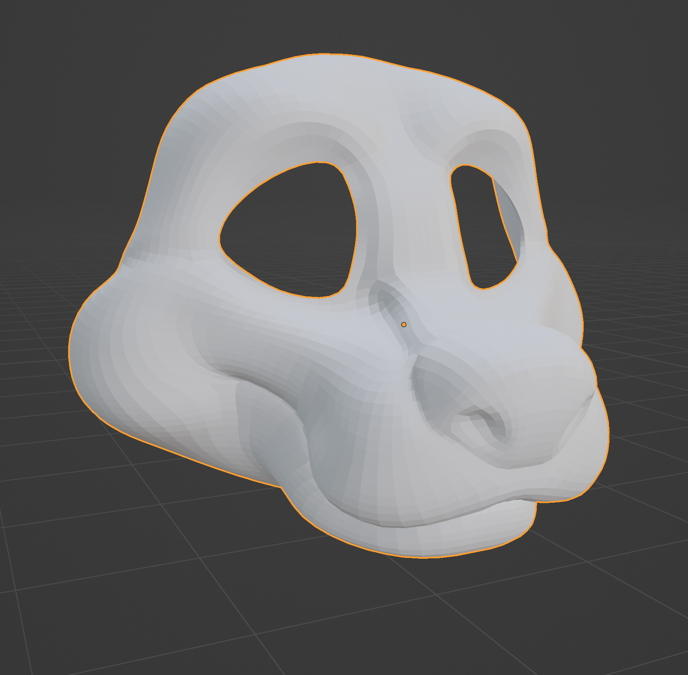
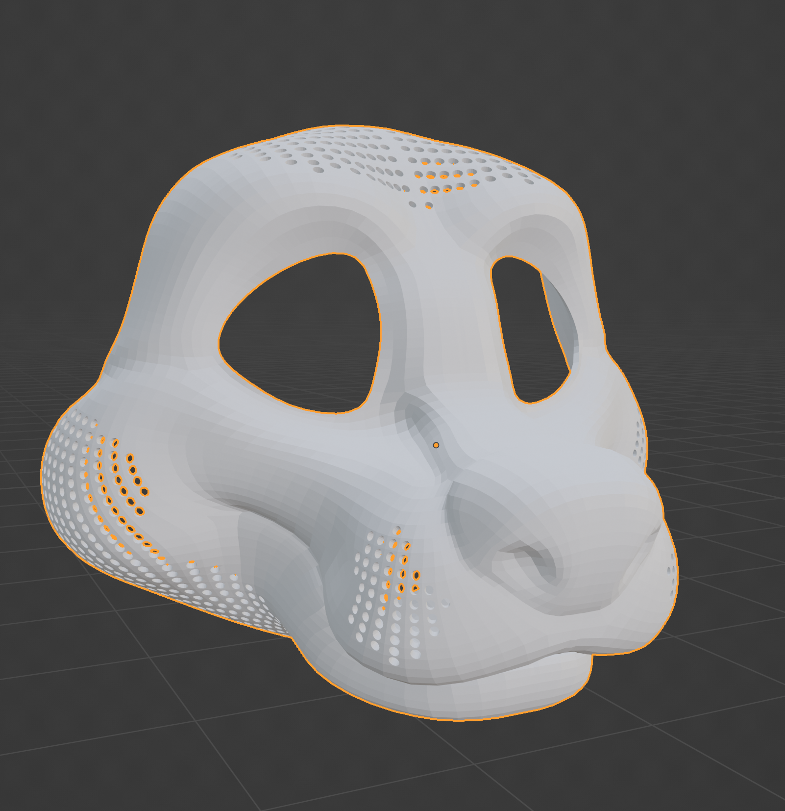
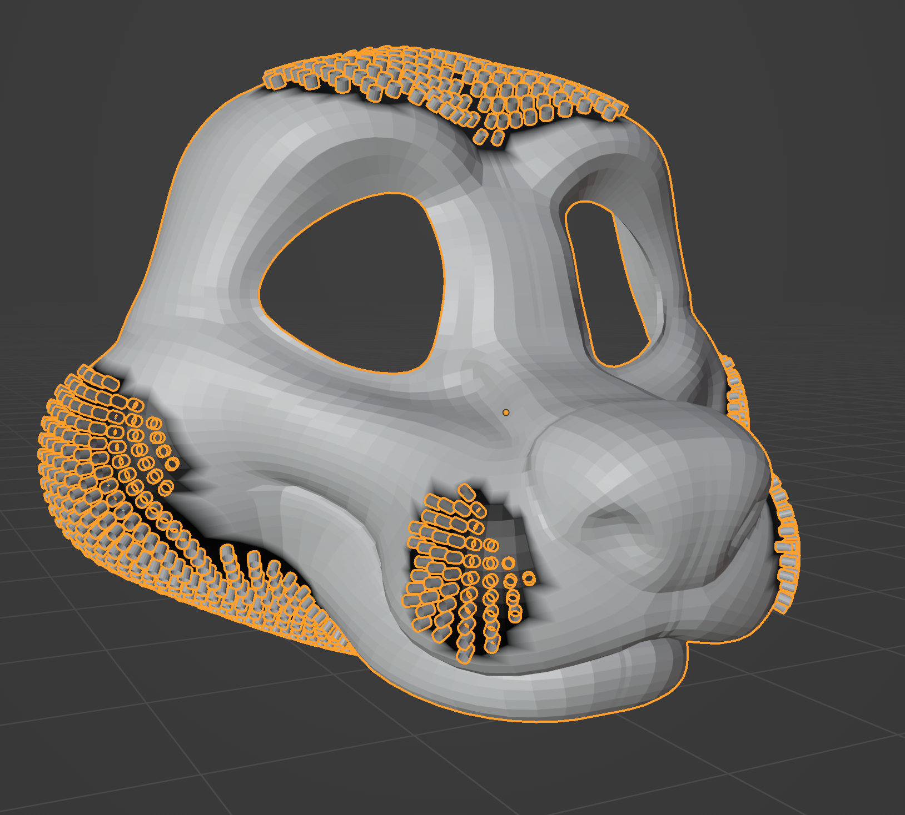
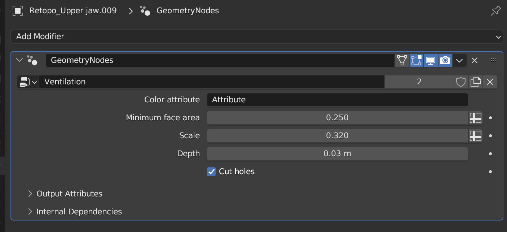

# ventilation

Geopack plugin to add a modifier that punches holes in selected faces of your model. I use it to add holes in fursuit heads for ventilation (hence the name) or to reduce the weight of the head.

## Installation

This plugin uses Geopack https://abaga.gumroad.com/l/GcYmPC

## Example

### Before

### After

## Usage

The modifier use vertex paint to know where to put the holes, every face that is totally black will be intersected with a cylinder.

The modifiers has a few options.

* Color attribute: name of the color attribute
* Minimum face area: allows you to avoid punching holes in faces that are too small
* Scale: increase or decrease cylinders radius
* Depth: depth of the cylinders
* Cut holes: click to use the mesh boolean nodes and cut the holes, otherwise you'll just a preview of the cylinders position.
